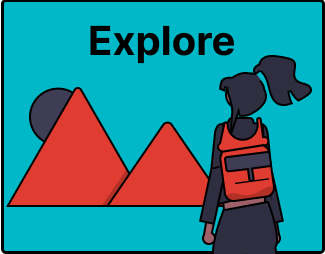

# 2. Explore Your Topic and Define Your Research Questions

At the start of your project, you may need to orientate yourself in your topic and find some initial overview articles to study in order to decide on the specific topic you will work on. You also have to develop your research question(s).

Common activities during this phase of the literature review include:

- [General Orientation on Your Topic](2a-general-orientation.md)

- [Exploring Academic Literature](2b-exploring-literature.md)

- [Developing Your Research Questions](2c-develop-question.md)

Study the next pages to learn how AI can support these activities.
