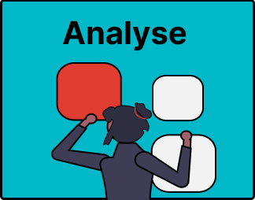

# 4. Analyse and Synthesise Findings from Selected Sources

When you have gathered enough sources for your literature review, you have to analyse the sources you found in order to answer your research question.

Common activities during this phase of the literature review include:

- [Reading and Summarising Sources](4a-reading-summarising.md)

- [Synthesising Findings](4b-synthesising.md)

Study the next pages to learn how AI can support these activities.
