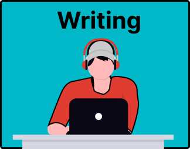

# 5. Write Your Text and Cite Sources

In the final phase of your project, you have to write a text to report about your research and refer to the sources that you used.

Common activities during this phase of the literature review include:

- [Drafting Your Text](5a-draft.md)
- [Revising and Editing Your Text](5b-revising.md)
- [Citing Your Sources](5c-citing.md)
- [Reporting about Your AI Use](5d-report-ai-use.md)

Study the next pages to learn how AI can support these activities.
